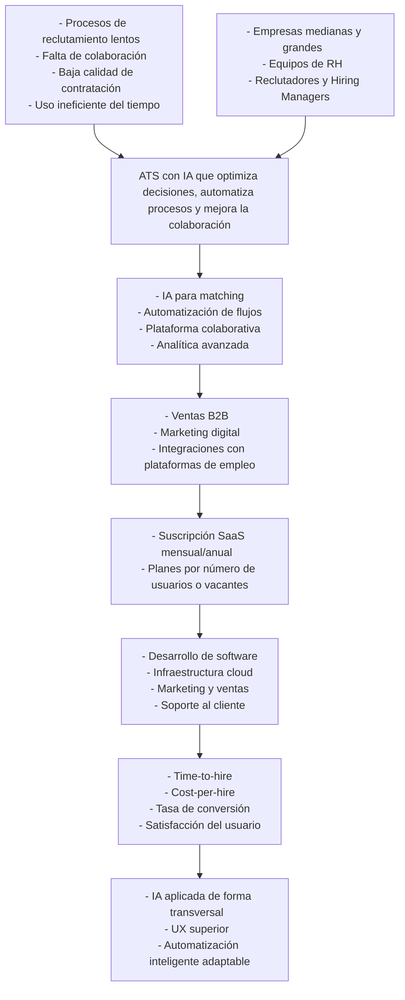
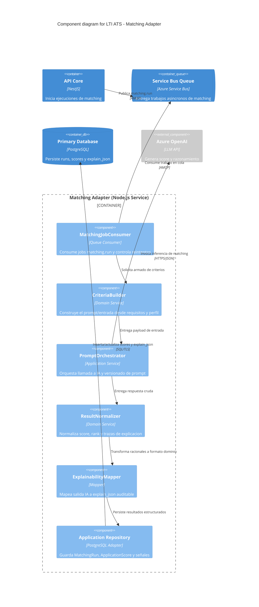

# 📌 Sistema ATS – LTI (Lean Talent Intelligence)

## Índice

1. [Descripción breve del software LTI, valor añadido y ventajas competitivas](#-descripción-breve-valor-añadido-y-ventajas-competitivas)
2. [Explicación de las funciones principales](#-funciones-principales)
3. [Lean Canvas del modelo de negocio](#-lean-canvas--lti)
4. [3 casos de uso principales + diagramas asociados](#casos-de-uso-principales)
5. [Modelo de datos (entidades, atributos y relaciones)](#modelo-de-datos)
6. [Diseño del sistema a alto nivel + diagrama](#propuesta-de-arquitectura-de-referencia-stack--azure)
7. [Diagrama C4 en profundidad de un componente](#diagrama-c4-en-profundidad-matching-adapter-nivel-3)

## 🧩 Descripción breve, valor añadido y ventajas competitivas

**LTI (Lean Talent Intelligence)** es un Applicant Tracking System (ATS) diseñado para **optimizar, automatizar y potenciar la toma de decisiones en reclutamiento** mediante inteligencia artificial y flujos colaborativos.

### 💡 Valor añadido
- Centraliza todo el proceso de reclutamiento en una sola plataforma  
- Utiliza IA para **mejorar la calidad de contratación**, no solo filtrar candidatos  
- Reduce significativamente el tiempo y esfuerzo del área de RH  

### 🏆 Ventajas competitivas
- IA aplicada en múltiples etapas (screening, matching, comunicación, análisis)
- Colaboración fluida entre reclutadores y managers en tiempo real  
- Automatización inteligente (no rígida, adaptable al contexto)  
- Enfoque en experiencia del candidato y employer branding  
- Analítica avanzada con insights accionables  

---

## ⚙️ Funciones principales

### 1. 📥 Gestión de candidatos
- Recepción automática de CVs desde múltiples fuentes  
- Parsing inteligente de información (experiencia, habilidades, educación)  
- Base de talento centralizada (Talent Pool)

### 2. 🤖 Filtrado y matching con IA
- Ranking automático de candidatos según la vacante  
- Identificación de candidatos ocultos (no evidentes a simple vista)  
- Sugerencias inteligentes de perfiles similares  

### 3. 🤝 Colaboración en equipo
- Evaluaciones compartidas entre reclutadores y managers  
- Comentarios en tiempo real  
- Scorecards estructurados para entrevistas  

### 4. 🔄 Automatización de procesos
- Flujos de reclutamiento configurables  
- Envío automático de correos y notificaciones  
- Programación de entrevistas  

### 5. 📊 Analítica y reportes
- Métricas clave: tiempo de contratación, eficiencia, conversión  
- Dashboards visuales con insights  
- Recomendaciones basadas en datos  

### 6. 📱 Experiencia del candidato
- Aplicación rápida y sencilla (mobile-first)  
- Seguimiento del estado de candidatura  
- Comunicación personalizada automatizada  

### 7. 🔗 Integraciones
- Portales de empleo  
- Sistemas internos (HRIS, ERP)  
- Herramientas de comunicación  

---

## 📊 Lean Canvas – LTI



---


# Casos de Uso Principales

## 1. Captura y gestión centralizada de candidatos (Talent Pool)

### Objetivo de negocio
Consolidar todos los candidatos en una única base para reducir dispersión, pérdida de información y tiempos operativos de RH.

### Roles involucrados
- **Reclutador:** opera la vacante, revisa perfiles y mantiene el pipeline.
- **Equipo RH:** estandariza criterios de información y calidad de datos.
- **Candidato (indirecto):** envía su aplicación desde distintos canales.

### Dependencias
- Integraciones con **portales de empleo** y otras fuentes de CV.
- Módulo de **parsing inteligente** (experiencia, habilidades, educación).
- Repositorio central **Talent Pool**.
- Integración opcional con sistemas internos (**HRIS/ERP**) para sincronización.

### Acciones clave (flujo)
1. Publicar/activar vacante conectada a múltiples fuentes.
2. Recibir CVs automáticamente.
3. Parsear y estructurar la información de cada candidato.
4. Normalizar y guardar en base centralizada.
5. Etiquetar/segmentar para búsqueda posterior.
6. Avanzar candidatos al siguiente paso de evaluación.

### Diagrama de caso de uso
```
@startuml
left to right direction
skinparam packageStyle rectangle
skinparam shadowing false

actor Candidato
actor Reclutador
actor "Equipo RH" as EquipoRH
actor "Portal de Empleo" as Portal
actor "HRIS/ERP" as HRIS

rectangle "LTI ATS" as Sistema {
  usecase "Aplicar a vacante" as UC1
  usecase "Recibir CV automáticamente" as UC2
  usecase "Parsear CV" as UC3
  usecase "Normalizar datos\nde candidato" as UC4
  usecase "Almacenar en Talent Pool" as UC5
  usecase "Etiquetar y segmentar\nperfil" as UC6
  usecase "Consultar candidatos" as UC7
  usecase "Configurar criterios\nde calidad de datos" as UC8
  usecase "Sincronizar datos con\nsistemas internos" as UC9
}

Candidato --> UC1
Portal --> UC2
Reclutador --> UC7
EquipoRH --> UC8
HRIS --> UC9

UC1 --> UC2 : <<include>>
UC2 --> UC3 : <<include>>
UC3 --> UC4 : <<include>>
UC4 --> UC5 : <<include>>
UC5 --> UC6 : <<extend>>
UC5 --> UC9 : <<extend>>

@enduml
```

## 2. Filtrado y matching inteligente con IA para priorización de talento

### Objetivo de negocio
Mejorar la calidad de contratación y reducir el tiempo de screening priorizando candidatos con mejor ajuste a la vacante.

### Roles involucrados
- **Reclutador:** define criterios y valida shortlist sugerida.
- **Hiring Manager:** revisa candidatos top para decisión técnica/funcional.
- **Motor IA (sistema):** puntúa, rankea y recomienda perfiles similares.

### Dependencias
- Datos estructurados de candidatos (provenientes del caso de uso 1).
- Definición clara de requisitos de vacante (hard/soft skills, seniority).
- Algoritmos de **ranking**, **matching** y detección de candidatos “ocultos”.
- Histórico de desempeño o señales de calidad (si existe).

### Acciones clave (flujo)
1. Configurar vacante y criterios de evaluación.
2. Ejecutar matching IA sobre el pool.
3. Generar ranking automático de candidatos.
4. Detectar perfiles no evidentes pero potencialmente valiosos.
5. Sugerir candidatos similares.
6. Reclutador/Hiring Manager validan shortlist y pasan a entrevistas.

### Diagrama de caso de uso
```
@startuml
left to right direction
skinparam packageStyle rectangle
skinparam shadowing false

actor Reclutador
actor "Hiring Manager" as HiringManager
actor "Servicio IA" as IA

rectangle "LTI ATS" as Sistema {
  usecase "Definir criterios\nde vacante" as UC1
  usecase "Ejecutar matching IA" as UC2
  usecase "Rankear candidatos" as UC3
  usecase "Detectar candidatos\nocultos" as UC4
  usecase "Sugerir perfiles\nsimilares" as UC5
  usecase "Revisar shortlist" as UC6
  usecase "Validar candidatos\npreseleccionados" as UC7
  usecase "Enviar candidatos a\nentrevista" as UC8
}

Reclutador --> UC1
Reclutador --> UC6
HiringManager --> UC7
IA --> UC2

UC2 --> UC3 : <<include>>
UC2 --> UC4 : <<include>>
UC2 --> UC5 : <<include>>
UC3 --> UC6 : <<include>>
UC6 --> UC7 : <<include>>
UC7 --> UC8 : <<include>>

@enduml
```


## 3. Colaboración y automatización del proceso de selección end-to-end

### Objetivo de negocio
Acelerar decisiones y evitar cuellos de botella coordinando a reclutadores y managers con flujos automáticos y trazables.

### Roles involucrados
- **Reclutador:** coordina etapas, comunicaciones y agenda.
- **Hiring Manager:** evalúa y da feedback en scorecards.
- **Entrevistadores (si aplica):** completan evaluaciones.
- **Candidato:** recibe notificaciones y seguimiento del estado.

### Dependencias
- Flujos de reclutamiento configurables por etapa.
- Sistema de **comentarios en tiempo real** y **evaluaciones compartidas**.
- **Scorecards estructurados** para estandarizar entrevistas.
- Automatización de **emails/notificaciones** y programación de entrevistas.
- Herramientas de comunicación/calendario integradas.

### Acciones clave (flujo)
1. Definir pipeline de selección (etapas y responsables).
2. Asignar candidatos a entrevistas.
3. Ejecutar entrevistas y completar scorecards.
4. Compartir feedback y comentarios en tiempo real.
5. Automatizar comunicaciones (avances, recordatorios, estado).
6. Consolidar decisión y cerrar vacante con trazabilidad completa.

### Diagrama de caso de uso
```
@startuml
left to right direction
skinparam packageStyle rectangle
skinparam shadowing false

actor Reclutador
actor "Hiring Manager" as HiringManager
actor Entrevistador
actor Candidato
actor "Calendario/Email" as Calendario

rectangle "LTI ATS" as Sistema {
  usecase "Definir pipeline\nde selección" as UC1
  usecase "Asignar entrevistas" as UC2
  usecase "Programar entrevistas" as UC3
  usecase "Completar scorecard" as UC4
  usecase "Compartir feedback\nen tiempo real" as UC5
  usecase "Consolidar decisión" as UC6
  usecase "Notificar estado\na candidato" as UC7
  usecase "Cerrar vacante\ncon trazabilidad" as UC8
  usecase "Enviar recordatorios\na entrevistadores" as UC9
}

Reclutador --> UC1
Reclutador --> UC2
Reclutador --> UC6
HiringManager --> UC4
HiringManager --> UC5
Entrevistador --> UC4
Candidato --> UC7
Calendario --> UC3
Calendario --> UC9

UC2 --> UC3 : <<include>>
UC3 --> UC9 : <<extend>>
UC4 --> UC5 : <<include>>
UC5 --> UC6 : <<include>>
UC6 --> UC7 : <<include>>
UC6 --> UC8 : <<include>>

@enduml
```
## 4. Diagramas de caso de uso adicionales

### 4.1 Diagrama Consolidado(un solo LTI ATS)
```
@startuml
left to right direction
skinparam packageStyle rectangle
skinparam shadowing false

actor Candidato
actor Reclutador
actor "Equipo RH" as EquipoRH
actor "Hiring Manager" as HiringManager
actor Entrevistador
actor "Portal de Empleo" as Portal
actor "HRIS/ERP" as HRIS
actor "Servicio IA" as IA
actor "Calendario/Email" as Calendario

rectangle "LTI ATS" as Sistema {

  package "1) Captura y gestión\ncentralizada (Talent Pool)" as P1 {
    usecase "Aplicar a vacante" as UC_A1
    usecase "Recibir CV automáticamente" as UC_A2
    usecase "Parsear CV" as UC_A3
    usecase "Normalizar datos\nde candidato" as UC_A4
    usecase "Almacenar en Talent Pool" as UC_A5
    usecase "Etiquetar y segmentar\nperfil" as UC_A6
    usecase "Consultar candidatos" as UC_A7
    usecase "Configurar criterios\nde calidad de datos" as UC_A8
    usecase "Sincronizar datos con\nsistemas internos" as UC_A9
  }

  package "2) Filtrado y matching\ncon IA" as P2 {
    usecase "Definir criterios\nde vacante" as UC_B1
    usecase "Ejecutar matching IA" as UC_B2
    usecase "Rankear candidatos" as UC_B3
    usecase "Detectar candidatos\nocultos" as UC_B4
    usecase "Sugerir perfiles\nsimilares" as UC_B5
    usecase "Revisar shortlist" as UC_B6
    usecase "Validar candidatos\npreseleccionados" as UC_B7
    usecase "Enviar candidatos a\nentrevista" as UC_B8
  }

  package "3) Colaboración y automatización\nend-to-end" as P3 {
    usecase "Definir pipeline\nde selección" as UC_C1
    usecase "Asignar entrevistas" as UC_C2
    usecase "Programar entrevistas" as UC_C3
    usecase "Completar scorecard" as UC_C4
    usecase "Compartir feedback\nen tiempo real" as UC_C5
    usecase "Consolidar decisión" as UC_C6
    usecase "Notificar estado\na candidato" as UC_C7
    usecase "Cerrar vacante\ncon trazabilidad" as UC_C8
    usecase "Enviar recordatorios\na entrevistadores" as UC_C9
  }
}

' Actores externos
Candidato --> UC_A1
Portal --> UC_A2
HRIS --> UC_A9
IA --> UC_B2
Calendario --> UC_C3
Calendario --> UC_C9

' Roles internos
Reclutador --> UC_A7
Reclutador --> UC_B6
Reclutador --> UC_C1
Reclutador --> UC_C2
Reclutador --> UC_C6

EquipoRH --> UC_A8

HiringManager --> UC_B7
HiringManager --> UC_C4
HiringManager --> UC_C5

Entrevistador --> UC_C4
Candidato --> UC_C7

' Flujo 1
UC_A1 --> UC_A2 : <<include>>
UC_A2 --> UC_A3 : <<include>>
UC_A3 --> UC_A4 : <<include>>
UC_A4 --> UC_A5 : <<include>>
UC_A5 --> UC_A6 : <<extend>>
UC_A5 --> UC_A9 : <<extend>>

' Flujo 2
UC_B2 --> UC_B3 : <<include>>
UC_B2 --> UC_B4 : <<include>>
UC_B2 --> UC_B5 : <<include>>
UC_B3 --> UC_B6 : <<include>>
UC_B6 --> UC_B7 : <<include>>
UC_B7 --> UC_B8 : <<include>>

' Flujo 3
UC_C2 --> UC_C3 : <<include>>
UC_C3 --> UC_C9 : <<extend>>
UC_C4 --> UC_C5 : <<include>>
UC_C5 --> UC_C6 : <<include>>
UC_C6 --> UC_C7 : <<include>>
UC_C6 --> UC_C8 : <<include>>

' Dependencia entre macrocasos (opcional, pero útil para lectura)
UC_A5 ..> UC_B1 : <<include>>
UC_B8 ..> UC_C2 : <<include>>

@enduml
```
### 4.2 Diagrama ejecutivo (alto nivel, presentación)
```
@startuml
left to right direction
skinparam packageStyle rectangle
skinparam shadowing false

actor Candidato
actor Reclutador
actor "Hiring Manager" as HiringManager
actor "Sistemas externos\n(portales/HRIS/calendario)" as Externos
actor "Servicio IA" as IA

rectangle "LTI ATS" as Sistema {
  usecase "Capturar y centralizar\ncandidatos" as UC1
  usecase "Priorizar talento\ncon IA" as UC2
  usecase "Orquestar selección\ncolaborativa" as UC3
}

Candidato --> UC1
Externos --> UC1
Externos --> UC3
IA --> UC2

Reclutador --> UC1
Reclutador --> UC2
Reclutador --> UC3

HiringManager --> UC2
HiringManager --> UC3

UC1 --> UC2 : <<include>>
UC2 --> UC3 : <<include>>

@enduml
```

# Modelo de datos 

Este modelo de datos está pensado para soportar los **3 casos de uso principales** descritos arriba:

1. **Captura y gestión centralizada (Talent Pool)**: candidatos reutilizables, CVs, parsing y etiquetado.
2. **Matching con IA**: ejecuciones de matching, puntuaciones por vacante y sugerencias de similares.
3. **Colaboración y automatización**: pipelines configurables, aplicaciones en etapas, entrevistas, scorecards, comentarios y notificaciones.

> Convención de tipos: se usan tipos **lógicos** orientados a PostgreSQL (`UUID`, `TEXT`, `VARCHAR(n)`, `BOOLEAN`, `INTEGER`, `TIMESTAMPTZ`, `JSONB`). Los `ENUM` se listan como valores sugeridos.

## Multi-tenant y seguridad (base transversal)

### `Organization` (tenant)
- `id` (`UUID`, PK)
- `name` (`TEXT`)
- `slug` (`VARCHAR(80)`, UNIQUE)
- `created_at` (`TIMESTAMPTZ`)

### `User`
- `id` (`UUID`, PK)
- `email` (`VARCHAR(320)`, UNIQUE)
- `full_name` (`TEXT`)
- `is_active` (`BOOLEAN`)
- `created_at` (`TIMESTAMPTZ`)

### `Membership` (usuario dentro de una organización)
- `id` (`UUID`, PK)
- `organization_id` (`UUID`, FK → `Organization.id`)
- `user_id` (`UUID`, FK → `User.id`)
- `role` (`ENUM`: `RECRUITER`, `HIRING_MANAGER`, `INTERVIEWER`, `HR_ADMIN`, `ORG_ADMIN`)
- UNIQUE(`organization_id`, `user_id`)

## Caso de uso 1: Captura y gestión centralizada (Talent Pool)

### `Candidate` (persona en el pool; puede aplicar a varias vacantes)
- `id` (`UUID`, PK)
- `organization_id` (`UUID`, FK → `Organization.id`)
- `primary_email` (`VARCHAR(320)`)
- `phone` (`VARCHAR(40)`, nullable)
- `full_name` (`TEXT`)
- `location` (`TEXT`, nullable)
- `linkedin_url` (`TEXT`, nullable)
- `created_at` (`TIMESTAMPTZ`)
- `updated_at` (`TIMESTAMPTZ`)

### `CandidateConsent` (RGPD/opt-in si aplica)
- `id` (`UUID`, PK)
- `candidate_id` (`UUID`, FK → `Candidate.id`)
- `consent_type` (`ENUM`: `DATA_PROCESSING`, `MARKETING`, `RETENTION`)
- `granted` (`BOOLEAN`)
- `granted_at` (`TIMESTAMPTZ`)

### `ApplicationSource` (canal: portal propio, integración, importación, etc.)
- `id` (`UUID`, PK)
- `organization_id` (`UUID`, FK → `Organization.id`)
- `type` (`ENUM`: `CAREER_SITE`, `JOB_BOARD`, `REFERRAL`, `IMPORT`, `API`, `OTHER`)
- `name` (`TEXT`)
- `external_ref` (`TEXT`, nullable)

### `JobPosting`
- `id` (`UUID`, PK)
- `organization_id` (`UUID`, FK → `Organization.id`)
- `title` (`TEXT`)
- `status` (`ENUM`: `DRAFT`, `OPEN`, `ON_HOLD`, `CLOSED`)
- `description` (`TEXT`)
- `created_by_user_id` (`UUID`, FK → `User.id`)
- `opened_at` (`TIMESTAMPTZ`, nullable)
- `closed_at` (`TIMESTAMPTZ`, nullable)

### `Application` (relación candidato ↔ vacante; instancia del proceso)
- `id` (`UUID`, PK)
- `organization_id` (`UUID`, FK → `Organization.id`)
- `candidate_id` (`UUID`, FK → `Candidate.id`)
- `job_posting_id` (`UUID`, FK → `JobPosting.id`)
- `source_id` (`UUID`, FK → `ApplicationSource.id`, nullable)
- `current_stage_id` (`UUID`, FK → `PipelineStage.id`, nullable; se define en CU3)
- `status` (`ENUM`: `ACTIVE`, `WITHDRAWN`, `HIRED`, `REJECTED`)
- `applied_at` (`TIMESTAMPTZ`)
- UNIQUE(`candidate_id`, `job_posting_id`)

### `CvDocument` (archivo recibido)
- `id` (`UUID`, PK)
- `candidate_id` (`UUID`, FK → `Candidate.id`)
- `application_id` (`UUID`, FK → `Application.id`, nullable) — si el CV llega ligado a una candidatura concreta
- `storage_uri` (`TEXT`)
- `mime_type` (`VARCHAR(120)`)
- `file_name` (`TEXT`)
- `uploaded_at` (`TIMESTAMPTZ`)
- `checksum_sha256` (`VARCHAR(64)`, nullable)

### `CvParseJob` (trazabilidad del parsing)
- `id` (`UUID`, PK)
- `cv_document_id` (`UUID`, FK → `CvDocument.id`)
- `status` (`ENUM`: `QUEUED`, `RUNNING`, `SUCCEEDED`, `FAILED`)
- `parser_version` (`VARCHAR(40)`)
- `error_message` (`TEXT`, nullable)
- `started_at` (`TIMESTAMPTZ`, nullable)
- `finished_at` (`TIMESTAMPTZ`, nullable)

### `CandidateProfile` (snapshot normalizado “actual” del candidato)
- `id` (`UUID`, PK)
- `candidate_id` (`UUID`, FK → `Candidate.id`, UNIQUE)
- `headline` (`TEXT`, nullable)
- `summary` (`TEXT`, nullable)
- `years_experience` (`INTEGER`, nullable)
- `updated_at` (`TIMESTAMPTZ`)

### `Experience`, `Education`, `Skill` (normalización típica post-parse)
**`Experience`**
- `id` (`UUID`, PK)
- `candidate_profile_id` (`UUID`, FK → `CandidateProfile.id`)
- `company` (`TEXT`)
- `title` (`TEXT`)
- `start_date` (`DATE`, nullable)
- `end_date` (`DATE`, nullable)
- `description` (`TEXT`, nullable)

**`Education`**
- `id` (`UUID`, PK)
- `candidate_profile_id` (`UUID`, FK → `CandidateProfile.id`)
- `institution` (`TEXT`)
- `degree` (`TEXT`, nullable)
- `field` (`TEXT`, nullable)
- `start_date` (`DATE`, nullable)
- `end_date` (`DATE`, nullable)

**`Skill`**
- `id` (`UUID`, PK)
- `candidate_profile_id` (`UUID`, FK → `CandidateProfile.id`)
- `name` (`TEXT`)
- `level` (`ENUM`: `UNKNOWN`, `BASIC`, `INTERMEDIATE`, `ADVANCED`, `EXPERT`, nullable)

### `Tag` + `CandidateTag` (segmentación)
**`Tag`**
- `id` (`UUID`, PK)
- `organization_id` (`UUID`, FK → `Organization.id`)
- `name` (`TEXT`)
- UNIQUE(`organization_id`, `name`)

**`CandidateTag`**
- `candidate_id` (`UUID`, FK → `Candidate.id`)
- `tag_id` (`UUID`, FK → `Tag.id`)
- PK compuesta (`candidate_id`, `tag_id`)

### `ExternalIdentity` (sincronización HRIS/ERP u otros sistemas)
- `id` (`UUID`, PK)
- `organization_id` (`UUID`, FK → `Organization.id`)
- `entity_type` (`ENUM`: `CANDIDATE`, `APPLICATION`, `JOB_POSTING`)
- `entity_id` (`UUID`) — referencia polimórfica lógica (validada por app)
- `system` (`VARCHAR(80)`) — p.ej. `WORKDAY`, `SAP_SUCCESSFACTORS`
- `external_id` (`TEXT`)
- UNIQUE(`organization_id`, `entity_type`, `system`, `external_id`)

## Caso de uso 2: Filtrado y matching con IA

### `JobRequirement` (criterios explícitos de la vacante)
- `id` (`UUID`, PK)
- `job_posting_id` (`UUID`, FK → `JobPosting.id`)
- `kind` (`ENUM`: `MUST_HAVE_SKILL`, `NICE_TO_HAVE_SKILL`, `LANGUAGE`, `SENIORITY`, `LOCATION`, `CUSTOM`)
- `payload` (`JSONB`) — estructura flexible (lista de skills, radio km, etc.)
- `weight` (`INTEGER`, default 1)

### `MatchingRun` (cada ejecución del motor sobre una vacante)
- `id` (`UUID`, PK)
- `organization_id` (`UUID`, FK → `Organization.id`)
- `job_posting_id` (`UUID`, FK → `JobPosting.id`)
- `status` (`ENUM`: `QUEUED`, `RUNNING`, `SUCCEEDED`, `FAILED`)
- `model_name` (`VARCHAR(120)`)
- `model_version` (`VARCHAR(40)`)
- `started_at` (`TIMESTAMPTZ`, nullable)
- `finished_at` (`TIMESTAMPTZ`, nullable)

### `ApplicationScore` (ranking/puntuación por candidatura)
- `id` (`UUID`, PK)
- `matching_run_id` (`UUID`, FK → `MatchingRun.id`)
- `application_id` (`UUID`, FK → `Application.id`)
- `score_total` (`DECIMAL(6,3)`)
- `rank` (`INTEGER`, nullable)
- `explain_json` (`JSONB`, nullable) — trazas/razones para auditoría

### `CandidateMatchSignal` (candidatos “ocultos” / señales especiales)
- `id` (`UUID`, PK)
- `matching_run_id` (`UUID`, FK → `MatchingRun.id`)
- `application_id` (`UUID`, FK → `Application.id`)
- `signal_type` (`ENUM`: `HIDDEN_GEM`, `RISK`, `TRANSFERABLE_SKILLS`, `OTHER`)
- `details` (`JSONB`, nullable)

### `SimilarCandidate` (sugerencias de perfiles similares)
- `id` (`UUID`, PK)
- `matching_run_id` (`UUID`, FK → `MatchingRun.id`)
- `source_application_id` (`UUID`, FK → `Application.id`)
- `similar_application_id` (`UUID`, FK → `Application.id`)
- `similarity` (`DECIMAL(6,3)`)

## Caso de uso 3: Colaboración y automatización end-to-end

### `PipelineTemplate` + `PipelineStage` (definición reusable)
**`PipelineTemplate`**
- `id` (`UUID`, PK)
- `organization_id` (`UUID`, FK → `Organization.id`)
- `name` (`TEXT`)
- `is_default` (`BOOLEAN`)

**`PipelineStage`**
- `id` (`UUID`, PK)
- `pipeline_template_id` (`UUID`, FK → `PipelineTemplate.id`)
- `name` (`TEXT`)
- `order_index` (`INTEGER`)
- `stage_type` (`ENUM`: `SCREENING`, `INTERVIEW`, `OFFER`, `HIRED`, `CUSTOM`)

### `JobPostingPipeline` (pipeline activo por vacante)
- `id` (`UUID`, PK)
- `job_posting_id` (`UUID`, FK → `JobPosting.id`, UNIQUE)
- `pipeline_template_id` (`UUID`, FK → `PipelineTemplate.id`)

### `ApplicationStageHistory` (trazabilidad de movimientos)
- `id` (`UUID`, PK)
- `application_id` (`UUID`, FK → `Application.id`)
- `from_stage_id` (`UUID`, FK → `PipelineStage.id`, nullable)
- `to_stage_id` (`UUID`, FK → `PipelineStage.id`)
- `changed_by_user_id` (`UUID`, FK → `User.id`, nullable)
- `changed_at` (`TIMESTAMPTZ`)
- `reason` (`TEXT`, nullable)

### `Interview`
- `id` (`UUID`, PK)
- `application_id` (`UUID`, FK → `Application.id`)
- `stage_id` (`UUID`, FK → `PipelineStage.id`, nullable)
- `title` (`TEXT`)
- `starts_at` (`TIMESTAMPTZ`)
- `ends_at` (`TIMESTAMPTZ`)
- `location` (`TEXT`, nullable) — físico/URL
- `video_provider` (`ENUM`: `NONE`, `TEAMS`, `ZOOM`, `MEET`, `OTHER`, nullable)
- `external_event_id` (`TEXT`, nullable)

### `InterviewParticipant`
- `id` (`UUID`, PK)
- `interview_id` (`UUID`, FK → `Interview.id`)
- `user_id` (`UUID`, FK → `User.id`)
- `role` (`ENUM`: `HOST`, `INTERVIEWER`, `OBSERVER`)
- UNIQUE(`interview_id`, `user_id`)

### `ScorecardTemplate` + `ScorecardItem` + `ScorecardResponse`
**`ScorecardTemplate`**
- `id` (`UUID`, PK)
- `organization_id` (`UUID`, FK → `Organization.id`)
- `name` (`TEXT`)
- `version` (`INTEGER`)

**`ScorecardItem`**
- `id` (`UUID`, PK)
- `scorecard_template_id` (`UUID`, FK → `ScorecardTemplate.id`)
- `order_index` (`INTEGER`)
- `prompt` (`TEXT`)
- `response_type` (`ENUM`: `RATING_1_5`, `YES_NO`, `TEXT`)

**`ScorecardResponse`**
- `id` (`UUID`, PK)
- `interview_id` (`UUID`, FK → `Interview.id`)
- `respondent_user_id` (`UUID`, FK → `User.id`)
- `submitted_at` (`TIMESTAMPTZ`, nullable)

**`ScorecardAnswer`**
- `id` (`UUID`, PK)
- `scorecard_response_id` (`UUID`, FK → `ScorecardResponse.id`)
- `scorecard_item_id` (`UUID`, FK → `ScorecardItem.id`)
- `value_json` (`JSONB`) — rating/text/bool según `response_type`

### `CommentThread` + `Comment` (feedback en tiempo real, genérico)
**`CommentThread`**
- `id` (`UUID`, PK)
- `organization_id` (`UUID`, FK → `Organization.id`)
- `entity_type` (`ENUM`: `APPLICATION`, `INTERVIEW`, `CANDIDATE`)
- `entity_id` (`UUID`)

**`Comment`**
- `id` (`UUID`, PK)
- `thread_id` (`UUID`, FK → `CommentThread.id`)
- `author_user_id` (`UUID`, FK → `User.id`)
- `body` (`TEXT`)
- `created_at` (`TIMESTAMPTZ`)

### `Decision` (consolidación explícita)
- `id` (`UUID`, PK)
- `application_id` (`UUID`, FK → `Application.id`, UNIQUE)
- `outcome` (`ENUM`: `PROCEED`, `HOLD`, `REJECT`, `OFFER`, `HIRE`)
- `notes` (`TEXT`, nullable)
- `decided_by_user_id` (`UUID`, FK → `User.id`)
- `decided_at` (`TIMESTAMPTZ`)

### `Notification` + `MessageDelivery` (email/push/in-app)
**`Notification`**
- `id` (`UUID`, PK)
- `organization_id` (`UUID`, FK → `Organization.id`)
- `recipient_user_id` (`UUID`, FK → `User.id`, nullable)
- `recipient_candidate_id` (`UUID`, FK → `Candidate.id`, nullable)
- `channel` (`ENUM`: `EMAIL`, `IN_APP`, `SMS`, `PUSH`)
- `template_key` (`VARCHAR(120)`)
- `payload_json` (`JSONB`)
- `created_at` (`TIMESTAMPTZ`)

**`MessageDelivery`**
- `id` (`UUID`, PK)
- `notification_id` (`UUID`, FK → `Notification.id`)
- `status` (`ENUM`: `PENDING`, `SENT`, `FAILED`)
- `provider_message_id` (`TEXT`, nullable)
- `error_message` (`TEXT`, nullable)
- `sent_at` (`TIMESTAMPTZ`, nullable)

## Relaciones (cardinalidades clave)

- `Organization` **1—N** `Membership` **N—1** `User`
- `Organization` **1—N** `Candidate`
- `Candidate` **1—N** `Application` **N—1** `JobPosting` (UNIQUE por par)
- `Candidate` **1—N** `CvDocument` (típicamente muchos a lo largo del tiempo)
- `CvDocument` **1—N** `CvParseJob`
- `Candidate` **1—1** `CandidateProfile`; `CandidateProfile` **1—N** `Experience`/`Education`/`Skill`
- `JobPosting` **1—N** `JobRequirement`
- `JobPosting` **1—N** `MatchingRun`; `MatchingRun` **1—N** `ApplicationScore`
- `MatchingRun` **1—N** `SimilarCandidate`
- `JobPosting` **1—1** `JobPostingPipeline` **N—1** `PipelineTemplate`
- `PipelineTemplate` **1—N** `PipelineStage`
- `Application` **1—N** `ApplicationStageHistory`
- `Application` **1—N** `Interview`; `Interview` **1—N** `InterviewParticipant`
- `Interview` **1—N** `ScorecardResponse`; `ScorecardResponse` **1—N** `ScorecardAnswer`
- `Application` **1—1** `Decision` (opcional hasta que exista decisión explícita)

## Diagrama ER (Mermaid)

> Nota Mermaid: el atributo documentado como `field` en `Education` se representa como `study_field` en el diagrama (evita palabras reservadas). Semánticamente equivale a `Education.field`.

```mermaid
erDiagram
  Organization {
    uuid id PK
    text name
    varchar slug UK "len=80"
    timestamptz created_at
  }

  User {
    uuid id PK
    varchar email UK "len=320"
    text full_name
    boolean is_active
    timestamptz created_at
  }

  Membership {
    uuid id PK
    uuid organization_id FK
    uuid user_id FK
    varchar role "ENUM membership_role"
  }

  Candidate {
    uuid id PK
    uuid organization_id FK
    varchar primary_email "len=320"
    varchar phone "len=40 nullable"
    text full_name
    text location "nullable"
    text linkedin_url "nullable"
    timestamptz created_at
    timestamptz updated_at
  }

  CandidateConsent {
    uuid id PK
    uuid candidate_id FK
    varchar consent_type "ENUM consent_type"
    boolean granted
    timestamptz granted_at
  }

  ApplicationSource {
    uuid id PK
    uuid organization_id FK
    varchar type "ENUM source_type"
    text name
    text external_ref "nullable"
  }

  JobPosting {
    uuid id PK
    uuid organization_id FK
    text title
    varchar status "ENUM job_status"
    text description
    uuid created_by_user_id FK
    timestamptz opened_at "nullable"
    timestamptz closed_at "nullable"
  }

  Application {
    uuid id PK
    uuid organization_id FK
    uuid candidate_id FK
    uuid job_posting_id FK
    uuid source_id FK "nullable"
    uuid current_stage_id FK "nullable"
    varchar status "ENUM application_status"
    timestamptz applied_at
  }

  CvDocument {
    uuid id PK
    uuid candidate_id FK
    uuid application_id FK "nullable"
    text storage_uri
    varchar mime_type "len=120"
    text file_name
    timestamptz uploaded_at
    varchar checksum_sha256 "len=64 nullable"
  }

  CvParseJob {
    uuid id PK
    uuid cv_document_id FK
    varchar status "ENUM parse_job_status"
    varchar parser_version "len=40"
    text error_message "nullable"
    timestamptz started_at "nullable"
    timestamptz finished_at "nullable"
  }

  CandidateProfile {
    uuid id PK
    uuid candidate_id FK, UK
    text headline "nullable"
    text summary "nullable"
    int years_experience "nullable"
    timestamptz updated_at
  }

  Experience {
    uuid id PK
    uuid candidate_profile_id FK
    text company
    text title
    date start_date "nullable"
    date end_date "nullable"
    text description "nullable"
  }

  Education {
    uuid id PK
    uuid candidate_profile_id FK
    text institution
    text degree "nullable"
    text study_field "nullable maps_to=Education.field"
    date start_date "nullable"
    date end_date "nullable"
  }

  Skill {
    uuid id PK
    uuid candidate_profile_id FK
    text name
    varchar level "ENUM skill_level nullable"
  }

  Tag {
    uuid id PK
    uuid organization_id FK
    text name
  }

  CandidateTag {
    uuid candidate_id PK, FK
    uuid tag_id PK, FK
  }

  ExternalIdentity {
    uuid id PK
    uuid organization_id FK
    varchar entity_type "ENUM external_entity_type"
    uuid entity_id
    varchar system "len=80"
    text external_id
  }

  JobRequirement {
    uuid id PK
    uuid job_posting_id FK
    varchar kind "ENUM requirement_kind"
    jsonb payload
    int weight
  }

  MatchingRun {
    uuid id PK
    uuid organization_id FK
    uuid job_posting_id FK
    varchar status "ENUM matching_run_status"
    varchar model_name "len=120"
    varchar model_version "len=40"
    timestamptz started_at "nullable"
    timestamptz finished_at "nullable"
  }

  ApplicationScore {
    uuid id PK
    uuid matching_run_id FK
    uuid application_id FK
    decimal score_total "DECIMAL(6,3)"
    int rank "nullable"
    jsonb explain_json "nullable"
  }

  CandidateMatchSignal {
    uuid id PK
    uuid matching_run_id FK
    uuid application_id FK
    varchar signal_type "ENUM match_signal_type"
    jsonb details "nullable"
  }

  SimilarCandidate {
    uuid id PK
    uuid matching_run_id FK
    uuid source_application_id FK
    uuid similar_application_id FK
    decimal similarity "DECIMAL(6,3)"
  }

  PipelineTemplate {
    uuid id PK
    uuid organization_id FK
    text name
    boolean is_default
  }

  PipelineStage {
    uuid id PK
    uuid pipeline_template_id FK
    text name
    int order_index
    varchar stage_type "ENUM pipeline_stage_type"
  }

  JobPostingPipeline {
    uuid id PK
    uuid job_posting_id FK, UK
    uuid pipeline_template_id FK
  }

  ApplicationStageHistory {
    uuid id PK
    uuid application_id FK
    uuid from_stage_id FK "nullable"
    uuid to_stage_id FK
    uuid changed_by_user_id FK "nullable"
    timestamptz changed_at
    text reason "nullable"
  }

  Interview {
    uuid id PK
    uuid application_id FK
    uuid stage_id FK "nullable"
    text title
    timestamptz starts_at
    timestamptz ends_at
    text location "nullable"
    varchar video_provider "ENUM video_provider nullable"
    text external_event_id "nullable"
  }

  InterviewParticipant {
    uuid id PK
    uuid interview_id FK
    uuid user_id FK
    varchar role "ENUM interview_participant_role"
  }

  ScorecardTemplate {
    uuid id PK
    uuid organization_id FK
    text name
    int version
  }

  ScorecardItem {
    uuid id PK
    uuid scorecard_template_id FK
    int order_index
    text prompt
    varchar response_type "ENUM scorecard_response_type"
  }

  ScorecardResponse {
    uuid id PK
    uuid interview_id FK
    uuid respondent_user_id FK
    timestamptz submitted_at "nullable"
  }

  ScorecardAnswer {
    uuid id PK
    uuid scorecard_response_id FK
    uuid scorecard_item_id FK
    jsonb value_json
  }

  CommentThread {
    uuid id PK
    uuid organization_id FK
    varchar entity_type "ENUM comment_entity_type"
    uuid entity_id
  }

  Comment {
    uuid id PK
    uuid thread_id FK
    uuid author_user_id FK
    text body
    timestamptz created_at
  }

  Decision {
    uuid id PK
    uuid application_id FK, UK
    varchar outcome "ENUM decision_outcome"
    text notes "nullable"
    uuid decided_by_user_id FK
    timestamptz decided_at
  }

  Notification {
    uuid id PK
    uuid organization_id FK
    uuid recipient_user_id FK "nullable"
    uuid recipient_candidate_id FK "nullable"
    varchar channel "ENUM notification_channel"
    varchar template_key "len=120"
    jsonb payload_json
    timestamptz created_at
  }

  MessageDelivery {
    uuid id PK
    uuid notification_id FK
    varchar status "ENUM delivery_status"
    text provider_message_id "nullable"
    text error_message "nullable"
    timestamptz sent_at "nullable"
  }

  Organization ||--o{ Membership : has
  User ||--o{ Membership : belongs

  Organization ||--o{ Candidate : owns
  Candidate ||--o{ CandidateConsent : consents

  Organization ||--o{ ApplicationSource : defines
  Organization ||--o{ JobPosting : owns
  User ||--o{ JobPosting : creates

  Candidate ||--o{ Application : applies
  JobPosting ||--o{ Application : receives
  ApplicationSource ||--o{ Application : attributes

  PipelineStage ||--o{ Application : current_stage

  Candidate ||--o{ CvDocument : uploads
  Application ||--o{ CvDocument : optional_link
  CvDocument ||--o{ CvParseJob : parses

  Candidate ||--|| CandidateProfile : has
  CandidateProfile ||--o{ Experience : contains
  CandidateProfile ||--o{ Education : contains
  CandidateProfile ||--o{ Skill : contains

  Organization ||--o{ Tag : defines
  Candidate ||--o{ CandidateTag : tagged
  Tag ||--o{ CandidateTag : used_by

  Organization ||--o{ ExternalIdentity : maps

  JobPosting ||--o{ JobRequirement : defines
  JobPosting ||--o{ MatchingRun : runs
  Organization ||--o{ MatchingRun : scopes

  MatchingRun ||--o{ ApplicationScore : ranks
  Application ||--o{ ApplicationScore : scored_in_run

  MatchingRun ||--o{ CandidateMatchSignal : signals
  Application ||--o{ CandidateMatchSignal : signal_target

  MatchingRun ||--o{ SimilarCandidate : suggests
  Application ||--o{ SimilarCandidate : source_app
  Application ||--o{ SimilarCandidate : similar_app

  Organization ||--o{ PipelineTemplate : defines
  PipelineTemplate ||--o{ PipelineStage : ordered

  JobPosting ||--|| JobPostingPipeline : uses
  JobPostingPipeline }o--|| PipelineTemplate : template

  Application ||--o{ ApplicationStageHistory : moves
  PipelineStage ||--o{ ApplicationStageHistory : from_stage
  PipelineStage ||--o{ ApplicationStageHistory : to_stage
  User ||--o{ ApplicationStageHistory : changes

  Application ||--o{ Interview : schedules
  PipelineStage ||--o{ Interview : stage
  Interview ||--o{ InterviewParticipant : includes
  User ||--o{ InterviewParticipant : participates

  Interview ||--o{ ScorecardResponse : collects
  User ||--o{ ScorecardResponse : responds
  ScorecardResponse ||--o{ ScorecardAnswer : answers
  ScorecardItem ||--o{ ScorecardAnswer : item

  ScorecardTemplate ||--o{ ScorecardItem : structure

  Organization ||--o{ CommentThread : threads
  CommentThread ||--o{ Comment : has
  User ||--o{ Comment : writes

  Application ||--o| Decision : concludes
  User ||--o{ Decision : decides

  Organization ||--o{ Notification : sends
  User ||--o{ Notification : to_user
  Candidate ||--o{ Notification : to_candidate
  Notification ||--o{ MessageDelivery : delivers
```



## Decisiones de modelado (breve)

- **`Candidate` vs `Application`**: el pool vive en `Candidate`; cada proceso contra una vacante es un `Application` (evita duplicar personas y permite reutilización + histórico por vacante).
- **IA auditable**: `MatchingRun` + `ApplicationScore` + `explain_json` permite reconstruir *por qué* se rankeó en una fecha concreta (importante para compliance y mejora del modelo).
- **Colaboración genérica**: `CommentThread` polimórfico evita tablas duplicadas para comentarios en candidato vs candidatura vs entrevista (la validación `entity_type/entity_id` vive en la capa de dominio).

---

# Propuesta de arquitectura de referencia (stack + Azure)

Propuesta de **arquitectura de alto nivel** para LTI como ATS SaaS **multi-tenant**, con **IA auditable**, **integraciones** y **workflow colaborativo**, alineada con los casos de uso y el modelo de datos descritos en este documento.

## Contexto y restricciones

- **Dominio**: Talent Pool, matching con IA (`MatchingRun`, `ApplicationScore`, `explain_json`), pipelines, entrevistas, scorecards, comentarios y notificaciones.
- **Modelo de datos**: PostgreSQL (`UUID`, `JSONB`, `TIMESTAMPTZ`, `organization_id` en entidades de negocio).
- **No funcionales**: aislamiento por tenant, trazabilidad de decisiones de IA, procesamiento asíncrono (ingesta, matching, notificaciones), integraciones resilientes.

## Principios arquitectónicos

1. **Modularidad con despliegue pragmático**: límites lógicos (TalentAcquisition, IntelligenceMatching, HiringWorkflow, Collaboration, Integrations); posible **monolito modular** al inicio y extracción del servicio de matching si escala o coste de IA lo exigen.
2. **IA como dependencia acotada**: contrato estable hacia el núcleo; versionado de modelo y prompts; timeouts y degradación controlada.
3. **Consistencia fuerte en el núcleo transaccional**; **consistencia eventual** hacia integraciones, notificaciones y búsqueda (colas, idempotencia).
4. **Seguridad por defecto**: OIDC para usuarios internos, RBAC, aislamiento por `organization_id`, secretos en almacén gestionado, cifrado en tránsito y en reposo.

## Stack tecnológico sugerido (referencia)

| Capa | Elección principal | Alternativa enterprise |
|------|--------------------|-------------------------|
| SPA reclutadores / managers | React + TypeScript (Vite), TanStack Query, componentes accesibles (Radix o MUI) | Angular |
| Portal candidato (SEO / mobile-first) | Next.js (React) + TypeScript (SSR/ISR para empleo público) | Nuxt (Vue) |
| API / BFF | NestJS (Node + TypeScript), OpenAPI, guards RBAC, módulos por bounded context | Spring Boot o ASP.NET Core |
| Persistencia | PostgreSQL 16+ (Azure Flexible Server), migraciones Flyway o Prisma migrate | Azure SQL si el estándar corporativo es .NET sin Postgres |
| Objetos (CVs) | Azure Blob Storage (opción inmutable/WORM si compliance) | Object storage compatible S3 en otra nube |
| Caché / rate limiting | Azure Cache for Redis | Redis solo en desarrollo |
| Mensajería / jobs | Azure Service Bus (colas + DLQ), workers en Azure Container Apps | Azure Event Grid + Functions para fan-out simple |
| IA (matching / parsing asistido) | Azure OpenAI vía servicio dedicado `matching-adapter`, políticas de contenido, prompts versionados | LLM self-hosted (mayor coste operativo) |
| Identidad interna | Microsoft Entra ID (OIDC) | Okta |
| Identidad candidato | Enlaces firmados y sesión limitada; Entra External ID si se requiere identidad persistente | Auth0 |
| Correo / calendario | Microsoft Graph (Teams/Outlook) donde aplique; SMTP transaccional como respaldo | SendGrid |
| Observabilidad | OpenTelemetry exportando a Azure Monitor / Application Insights | Datadog |
| IaC / CI-CD | Bicep o Terraform, GitHub Actions, Azure Container Registry | Azure Developer CLI (`azd`) si el equipo lo adopta |

**Patrones recomendados**: BFF opcional para agregaciones de UI; **Outbox** en PostgreSQL o publicación transaccional a Service Bus para eventos de dominio; **capa anticorrupción** en integraciones; **idempotency keys** en webhooks; CQRS ligero solo si la analítica en tiempo real lo justifica; **feature flags** para activar IA por etapa o por tenant.

## Infraestructura sugerida (Azure)

- **Edge**: Azure Front Door (TLS, WAF, enrutamiento) delante del front estático y de la API.
- **Compute**: Azure Container Apps para `api-core` (NestJS), `worker` (consumidores de Service Bus) y `matching-adapter` (escalado por profundidad de cola y CPU; límites de réplicas para controlar coste de tokens).
- **Datos**: Azure Database for PostgreSQL Flexible Server (HA donde aplique), Blob Storage, Azure Cache for Redis.
- **Integración**: Azure Service Bus con colas por tipo de trabajo (por ejemplo `cv.parse`, `matching.run`, `notifications.send`, `integrations.sync`).
- **Seguridad**: Azure Key Vault y Managed Identity entre servicios; Private Link hacia Postgres y Redis cuando sea viable.
- **Identidad**: Entra ID para empleados; Microsoft Graph para calendario y correo en tenant M365.
- **Observabilidad**: Application Insights, alertas sobre latencia de API, profundidad de colas, tasa de error de matching e integraciones.

**Entornos**: `dev` (SKU reducido), `staging` (datos anonimizados), `prod` (HA, backups PITR, revisiones periódicas de acceso).

## Flujos críticos y encaje con la infraestructura

- **Ingesta de CV (CU1)**: la API persiste metadatos, sube el binario a Blob y publica mensaje en cola; el worker ejecuta parsing, actualiza el perfil y emite señal de dominio (por ejemplo `CandidateProfileUpdated`).
- **Matching (CU2)**: la API registra `MatchingRun` y encola trabajo; `matching-adapter` invoca Azure OpenAI y persiste puntuaciones y `explain_json`; la UI consulta resultados versionados por ejecución.
- **Colaboración (CU3)**: la API atiende de forma síncrona pipeline, scorecards y comentarios; notificaciones y recordatorios vía cola; calendario vía Graph según el modelo de permisos (aplicación o delegado).

## Riesgos y mitigaciones

- **Coste y latencia de IA**: colas, procesamiento por lotes, límites de concurrencia; fase 2 con caché de embeddings si aplica; evitar re-ranking síncrono sobre listas muy grandes.
- **Fugas entre tenants**: pruebas de contrato en API; considerar **Row Level Security** en PostgreSQL; revisión sistemática de consultas filtradas por `organization_id`.
- **Integraciones frágiles**: reintentos con backoff, DLQ, idempotencia con `external_id` y tablas de correlación (`ExternalIdentity`).

## Diagrama de despliegue (Mermaid)

```mermaid
flowchart TB
  subgraph personas [Personas]
    recruiter[Reclutador]
    hiringManager[HiringManager]
    candidate[Candidato]
  end

  subgraph edge [EdgeAzure]
    afd[AzureFrontDoor]
    waf[WafPolicy]
  end

  subgraph clients [Clients]
    spaInternal[SpaReclutamiento]
    spaPublic[NextPortalCandidato]
  end

  subgraph compute [ComputeAzure]
    api[ApiCoreNest]
    worker[WorkerServiceBus]
    matchAdapter[MatchingAdapter]
  end

  subgraph data [DataPlane]
    pg[(PostgresFlexible)]
    redis[(AzureRedis)]
    blobs[(BlobCv)]
    sb[ServiceBusQueues]
  end

  subgraph ai [AiProviders]
    aoai[AzureOpenAI]
  end

  subgraph id [Identity]
    entra[EntraIdOIDC]
  end

  subgraph ext [ExternalSystems]
    jobBoards[PortalesEmpleo]
    hris[HrisErp]
    graph[MicrosoftGraph]
  end

  recruiter --> afd
  hiringManager --> afd
  candidate --> afd
  afd --> waf
  waf --> spaInternal
  waf --> spaPublic

  spaInternal --> api
  spaPublic --> api

  api --> entra
  api --> pg
  api --> redis
  api --> blobs
  api --> sb

  sb --> worker
  sb --> matchAdapter

  worker --> pg
  worker --> blobs
  worker --> graph
  worker --> hris
  worker --> jobBoards

  matchAdapter --> pg
  matchAdapter --> aoai
```

## Variantes de stack (sin cambiar la propuesta principal)

- **.NET**: ASP.NET Core (Web API + minimal/hosted services para workers), EF Core con PostgreSQL, front en Blazor o React/Next.js consumiendo la misma API; Azure App Service o Container Apps; Azure OpenAI vía SDK oficial.
- **Java**: Spring Boot 3 (modular por paquetes), Spring Security con OIDC (Entra), JOOQ o Hibernate con PostgreSQL; front React/Next.js; despliegue en Container Apps o AKS si ya hay estándar de orquestación.

En ambos casos se mantienen **los mismos servicios Azure de datos e integración** (Postgres Flexible Server, Blob, Redis, Service Bus, Front Door, Key Vault, Application Insights) para no duplicar operación y costes de aprendizaje.


## Referencias de documentación de arquitectura (C4)

La documentación detallada de arquitectura en formato C4 (Mermaid) está disponible en:

- [Índice de arquitectura](../docs/architecture/README.md)
- [C4 Nivel 1 - Contexto](../docs/architecture/c4-context.md)
- [C4 Nivel 2 - Contenedores](../docs/architecture/c4-containers.md)
- [C4 Deployment - Infraestructura](../docs/architecture/c4-deployment.md)
- [C4 Dynamic - Flujo de matching](../docs/architecture/c4-dynamic-matching-flow.md)

## Diagrama C4 en profundidad: Matching Adapter (Nivel 3)

Este diagrama C4 de **nivel componente** profundiza en el contenedor `matching-adapter`, mostrando los componentes internos clave para orquestar el matching con IA de forma trazable y auditable.


