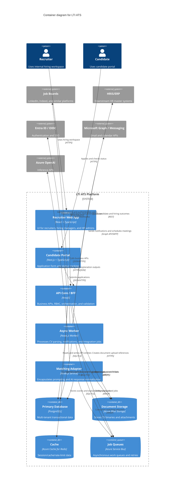

# LTI ATS - C4 Container Diagram

This view describes deployable containers and how they collaborate to support candidate ingestion, AI matching, collaboration workflows, and integrations.

```mermaid
C4Container
  title Container diagram for LTI ATS

  Person(recruiter, "Recruiter", "Uses internal hiring workspace")
  Person(candidate, "Candidate", "Uses candidate portal")

  System_Ext(jobBoards, "Job Boards", "LinkedIn, Indeed, and similar platforms")
  System_Ext(hrisErp, "HRIS/ERP", "Downstream HR master systems")
  System_Ext(identityProvider, "Entra ID / OIDC", "Authentication and SSO")
  System_Ext(graphComms, "Microsoft Graph / Messaging", "Email and calendar APIs")
  System_Ext(aiProvider, "Azure OpenAI", "Inference APIs")

  System_Boundary(ltiBoundary, "LTI ATS Platform") {
    Container(spaInternal, "Recruiter Web App", "React + TypeScript", "UI for recruiters, hiring managers, and HR admins")
    Container(spaCandidate, "Candidate Portal", "Next.js + TypeScript", "Application form and status tracking")
    Container(apiCore, "API Core / BFF", "NestJS", "Business APIs, RBAC, orchestration, and validation")
    Container(workerJobs, "Async Worker", "Node.js Worker", "Processes CV parsing, notifications, and integration jobs")
    Container(matchingAdapter, "Matching Adapter", "Node.js Service", "Encapsulates prompting and AI response normalization")
    ContainerDb(primaryDb, "Primary Database", "PostgreSQL", "Multi-tenant transactional data")
    ContainerDb(blobStore, "Document Storage", "Azure Blob Storage", "Stores CV binaries and attachments")
    ContainerDb(redisCache, "Cache", "Azure Cache for Redis", "Session/cache/rate-limit data")
    ContainerQueue(jobQueue, "Job Queues", "Azure Service Bus", "Asynchronous work queues and retries")
  }

  Rel(recruiter, spaInternal, "Uses hiring workspace", "HTTPS")
  Rel(candidate, spaCandidate, "Applies and checks status", "HTTPS")

  Rel(spaInternal, apiCore, "Calls business APIs", "JSON/HTTPS")
  Rel(spaCandidate, apiCore, "Submits applications", "JSON/HTTPS")

  Rel(apiCore, identityProvider, "Validates tokens and authenticates users", "OIDC/OAuth2")
  Rel(apiCore, primaryDb, "Reads and writes ATS entities", "SQL/TLS")
  Rel(apiCore, redisCache, "Caches hot reads and throttling state", "TLS")
  Rel(apiCore, blobStore, "Creates document upload references", "HTTPS")
  Rel(apiCore, jobQueue, "Enqueues async workloads", "AMQP")

  Rel(workerJobs, jobQueue, "Consumes queued jobs", "AMQP")
  Rel(workerJobs, primaryDb, "Updates workflow and integration state", "SQL/TLS")
  Rel(workerJobs, blobStore, "Reads uploaded CV files", "HTTPS")
  Rel(workerJobs, graphComms, "Sends notifications and schedules meetings", "Graph API/SMTP")
  Rel(workerJobs, hrisErp, "Syncs candidate and hiring outcomes", "REST")
  Rel(workerJobs, jobBoards, "Imports applications and posting updates", "REST/Webhooks")

  Rel(matchingAdapter, jobQueue, "Consumes matching requests", "AMQP")
  Rel(matchingAdapter, aiProvider, "Requests ranking and explanation outputs", "HTTPS/JSON")
  Rel(matchingAdapter, primaryDb, "Stores scores and explainability payloads", "SQL/TLS")
```

