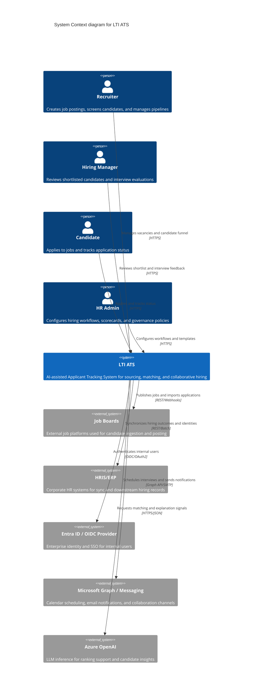

# LTI ATS - C4 System Context

This diagram shows how people and external systems interact with LTI (Lean Talent Intelligence) at the highest abstraction level.

```mermaid
C4Context
  title System Context diagram for LTI ATS

  Person(recruiter, "Recruiter", "Creates job postings, screens candidates, and manages pipelines")
  Person(hiringManager, "Hiring Manager", "Reviews shortlisted candidates and interview evaluations")
  Person(candidate, "Candidate", "Applies to jobs and tracks application status")
  Person(hrAdmin, "HR Admin", "Configures hiring workflows, scorecards, and governance policies")

  System(ltiAts, "LTI ATS", "AI-assisted Applicant Tracking System for sourcing, matching, and collaborative hiring")

  System_Ext(jobBoards, "Job Boards", "External job platforms used for candidate ingestion and posting")
  System_Ext(hrisErp, "HRIS/ERP", "Corporate HR systems for sync and downstream hiring records")
  System_Ext(identityProvider, "Entra ID / OIDC Provider", "Enterprise identity and SSO for internal users")
  System_Ext(graphComms, "Microsoft Graph / Messaging", "Calendar scheduling, email notifications, and collaboration channels")
  System_Ext(aiProvider, "Azure OpenAI", "LLM inference for ranking support and candidate insights")

  Rel(recruiter, ltiAts, "Manages vacancies and candidate funnel", "HTTPS")
  Rel(hiringManager, ltiAts, "Reviews shortlist and interview feedback", "HTTPS")
  Rel(candidate, ltiAts, "Applies and tracks status", "HTTPS")
  Rel(hrAdmin, ltiAts, "Configures workflows and templates", "HTTPS")

  Rel(ltiAts, jobBoards, "Publishes jobs and imports applications", "REST/Webhooks")
  Rel(ltiAts, hrisErp, "Synchronizes hiring outcomes and identities", "REST/Batch")
  Rel(ltiAts, identityProvider, "Authenticates internal users", "OIDC/OAuth2")
  Rel(ltiAts, graphComms, "Schedules interviews and sends notifications", "Graph API/SMTP")
  Rel(ltiAts, aiProvider, "Requests matching and explanation signals", "HTTPS/JSON")
```

