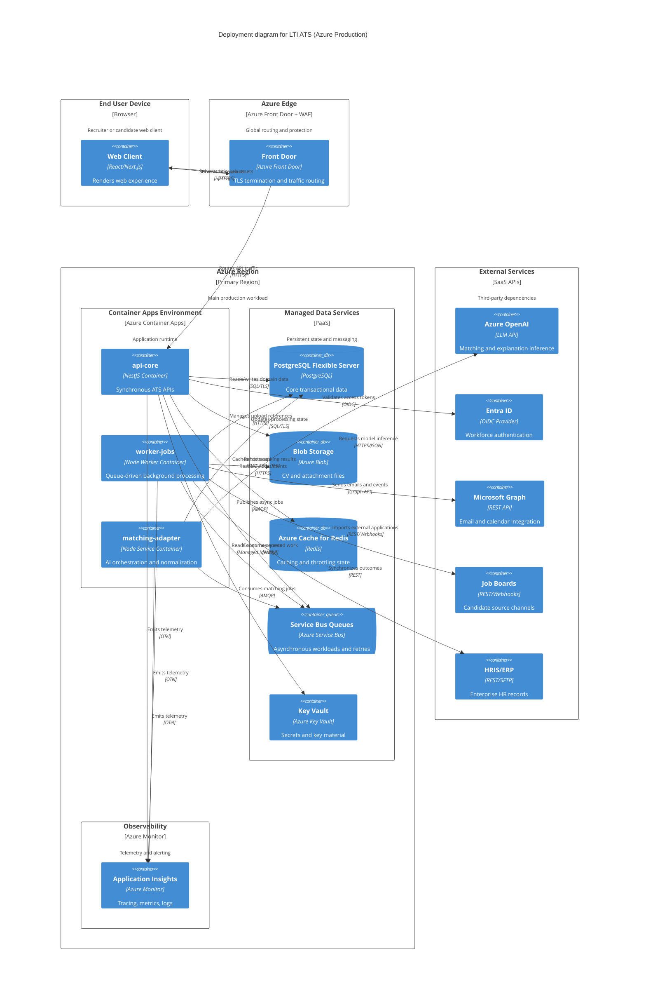

# LTI ATS - C4 Deployment Diagram

This diagram maps runtime containers to the proposed Azure infrastructure for production.

```mermaid
C4Deployment
  title Deployment diagram for LTI ATS (Azure Production)

  Deployment_Node(userDevice, "End User Device", "Browser", "Recruiter or candidate web client") {
    Container(clientApp, "Web Client", "React/Next.js", "Renders web experience")
  }

  Deployment_Node(edge, "Azure Edge", "Azure Front Door + WAF", "Global routing and protection") {
    Container(frontDoor, "Front Door", "Azure Front Door", "TLS termination and traffic routing")
  }

  Deployment_Node(azureRegion, "Azure Region", "Primary Region", "Main production workload") {
    Deployment_Node(containerAppsEnv, "Container Apps Environment", "Azure Container Apps", "Application runtime") {
      Container(apiCore, "api-core", "NestJS Container", "Synchronous ATS APIs")
      Container(workerJobs, "worker-jobs", "Node Worker Container", "Queue-driven background processing")
      Container(matchingAdapter, "matching-adapter", "Node Service Container", "AI orchestration and normalization")
    }

    Deployment_Node(dataServices, "Managed Data Services", "PaaS", "Persistent state and messaging") {
      ContainerDb(primaryDb, "PostgreSQL Flexible Server", "PostgreSQL", "Core transactional data")
      ContainerDb(blobStore, "Blob Storage", "Azure Blob", "CV and attachment files")
      ContainerDb(redisCache, "Azure Cache for Redis", "Redis", "Caching and throttling state")
      ContainerQueue(jobQueue, "Service Bus Queues", "Azure Service Bus", "Asynchronous workloads and retries")
      Container(secretStore, "Key Vault", "Azure Key Vault", "Secrets and key material")
    }

    Deployment_Node(observability, "Observability", "Azure Monitor", "Telemetry and alerting") {
      Container(appInsights, "Application Insights", "Azure Monitor", "Tracing, metrics, logs")
    }
  }

  Deployment_Node(externalSaas, "External Services", "SaaS APIs", "Third-party dependencies") {
    Container(aiProvider, "Azure OpenAI", "LLM API", "Matching and explanation inference")
    Container(identityProvider, "Entra ID", "OIDC Provider", "Workforce authentication")
    Container(graphComms, "Microsoft Graph", "REST API", "Email and calendar integration")
    Container(jobBoards, "Job Boards", "REST/Webhooks", "Candidate source channels")
    Container(hrisErp, "HRIS/ERP", "REST/SFTP", "Enterprise HR records")
  }

  Rel(clientApp, frontDoor, "Submits UI requests", "HTTPS")
  Rel(frontDoor, apiCore, "Routes API traffic", "HTTPS")
  Rel(frontDoor, clientApp, "Serves static web assets", "HTTPS")

  Rel(apiCore, primaryDb, "Reads/writes domain data", "SQL/TLS")
  Rel(apiCore, redisCache, "Caches hot reads", "TLS")
  Rel(apiCore, blobStore, "Manages upload references", "HTTPS")
  Rel(apiCore, jobQueue, "Publishes async jobs", "AMQP")
  Rel(apiCore, identityProvider, "Validates access tokens", "OIDC")
  Rel(apiCore, secretStore, "Reads runtime secrets", "Managed Identity")
  Rel(apiCore, appInsights, "Emits telemetry", "OTel")

  Rel(workerJobs, jobQueue, "Consumes queued work", "AMQP")
  Rel(workerJobs, primaryDb, "Updates processing state", "SQL/TLS")
  Rel(workerJobs, blobStore, "Reads CV documents", "HTTPS")
  Rel(workerJobs, graphComms, "Sends emails and events", "Graph API")
  Rel(workerJobs, hrisErp, "Synchronizes outcomes", "REST")
  Rel(workerJobs, jobBoards, "Imports external applications", "REST/Webhooks")
  Rel(workerJobs, appInsights, "Emits telemetry", "OTel")

  Rel(matchingAdapter, jobQueue, "Consumes matching jobs", "AMQP")
  Rel(matchingAdapter, aiProvider, "Requests model inference", "HTTPS/JSON")
  Rel(matchingAdapter, primaryDb, "Persists ranking results", "SQL/TLS")
  Rel(matchingAdapter, appInsights, "Emits telemetry", "OTel")
```

