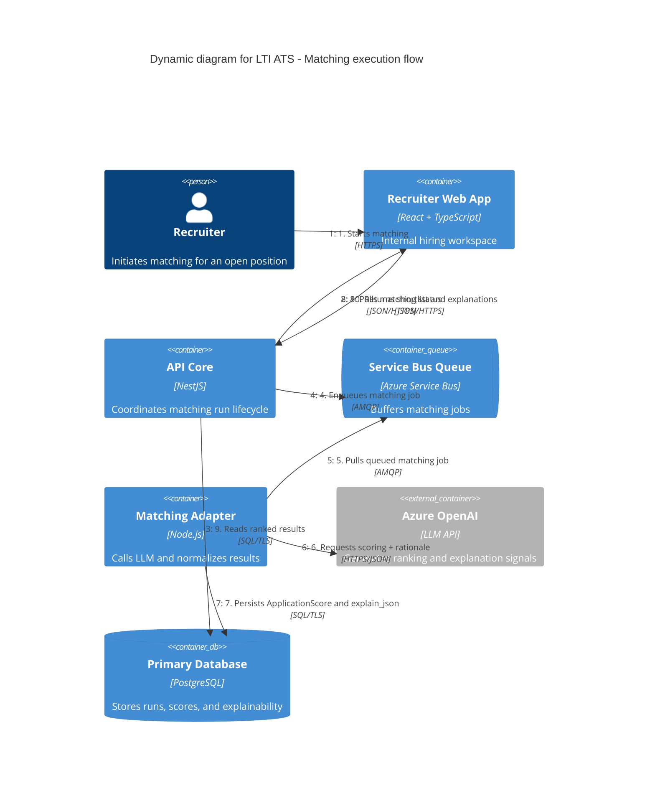

# LTI ATS - C4 Dynamic Diagram (Matching Flow)

This dynamic view documents the end-to-end sequence for AI-driven candidate matching.

```mermaid
C4Dynamic
  title Dynamic diagram for LTI ATS - Matching execution flow

  Person(recruiter, "Recruiter", "Initiates matching for an open position")
  Container(spaInternal, "Recruiter Web App", "React + TypeScript", "Internal hiring workspace")
  Container(apiCore, "API Core", "NestJS", "Coordinates matching run lifecycle")
  ContainerQueue(jobQueue, "Service Bus Queue", "Azure Service Bus", "Buffers matching jobs")
  Container(matchingAdapter, "Matching Adapter", "Node.js", "Calls LLM and normalizes results")
  Container_Ext(aiProvider, "Azure OpenAI", "LLM API", "Generates ranking and explanation signals")
  ContainerDb(primaryDb, "Primary Database", "PostgreSQL", "Stores runs, scores, and explainability")

  Rel(recruiter, spaInternal, "1. Starts matching", "HTTPS")
  Rel(spaInternal, apiCore, "2. Sends match request", "JSON/HTTPS")
  Rel(apiCore, primaryDb, "3. Creates MatchingRun record", "SQL/TLS")
  Rel(apiCore, jobQueue, "4. Enqueues matching job", "AMQP")
  Rel(matchingAdapter, jobQueue, "5. Pulls queued matching job", "AMQP")
  Rel(matchingAdapter, aiProvider, "6. Requests scoring + rationale", "HTTPS/JSON")
  Rel(matchingAdapter, primaryDb, "7. Persists ApplicationScore and explain_json", "SQL/TLS")
  Rel(spaInternal, apiCore, "8. Polls matching status", "JSON/HTTPS")
  Rel(apiCore, primaryDb, "9. Reads ranked results", "SQL/TLS")
  Rel(apiCore, spaInternal, "10. Returns shortlist and explanations", "JSON/HTTPS")
```

